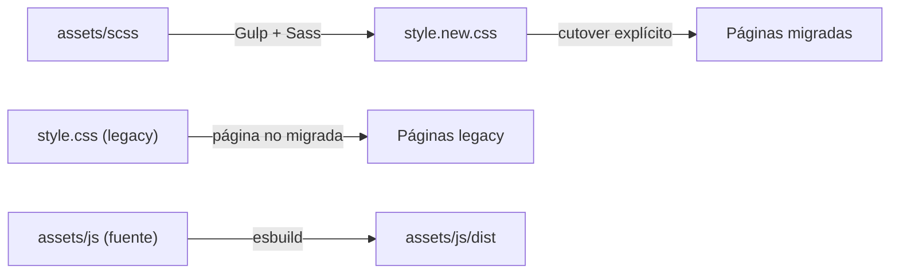

# Arquitectura — The Clandestino USA

Describe la arquitectura **vigente** y el **objetivo inmediato**. Lo marcado como *futuro* aún no existe en el repo.

## Vigente

- Páginas `.html` estáticas y PHP puntual (`contact.php`, `reservation.php`).
- CSS legacy en `assets/css/` (`style.css`, `style.min.css` y hojas específicas como `faq-styles.css`, `form-feedback.css`, `pure-soul.css`, `whatsapp-float.css`).
- JavaScript por página en `assets/js/` (scripts sueltos, sin bundler).
- Hosting: GoDaddy shared (cPanel). Despliegue de archivos estáticos y PHP simple.
- Inventario de UI actual: `docs/LEGACY-UI-INVENTORY.md`.

## Tooling frontend (vigente)

Pipeline mínimo en `gulpfile.mjs`. Solo prueba el pipeline: no incluye aún design system ni componentes propios. El legacy no se compila ni se modifica.

| Pieza | Detalle |
|---|---|
| Sass | Entrada `assets/scss/main.scss` → `assets/css/style.new.css` |
| Bootstrap | 5.3.x desde `node_modules`, solo núcleo (root, reboot, containers, grid, helpers) |
| PostCSS | Autoprefixer siempre; cssnano solo en `build` |
| JS | Entrada `assets/js/main.js` → `assets/js/dist/main.js` (esbuild, ESM, `es2020`) |
| PHP local | `php -S 127.0.0.1:8000` lanzado por Gulp y cerrado al salir |
| BrowserSync | `http://localhost:3000` con proxy a PHP `:8000` (PHP real, no estáticos) |
| Lint | ESLint (JS nuevo y `.mjs` de tooling) y Stylelint (`assets/scss/**`) |

Comandos: `npm run dev` (clean → CSS+JS dev con sourcemaps → PHP → BrowserSync → watch), `npm run build` (clean → CSS+JS minificados, sin sourcemaps, sin servidores), `npm run lint`.

Outputs (ignorados por git): `assets/css/style.new.css`, `assets/css/style.new.css.map` (solo dev) y `assets/js/dist/**`. `clean` borra únicamente estos.

Separación legacy/new: los cambios en HTML/PHP/CSS/JS legacy solo recargan BrowserSync; no se compilan, optimizan ni regeneran (imágenes, sitemap).

## Objetivo inmediato (futuro)

| Capa | Objetivo |
|---|---|
| Estilos | SCSS (7-1 pragmático) con carpetas creadas al tener contenido, BEM `cl-` |
| JavaScript | Módulos en `assets/js/modules/**` importados desde `main.js` |
| PHP | Simple primero; estructura solo cuando la complejidad lo pida |
| Datos | MySQL solo cuando una feature (checkout, Wine Club, reservas) lo requiera |

## Estrategia CSS: migración incremental

- `style.css` es **legacy** y sigue siendo el CSS de producción hasta su cutover.
- `style.new.css` es el **output** de la nueva arquitectura SCSS (aún no referenciado por ninguna página).
- La migración es **página por página**, con **cutover explícito**: cada página usa uno u otro sistema, y se cambia en un commit deliberado.
- **No cargar ambos sistemas indiscriminadamente** en la misma página: evita conflictos de especificidad y peso innecesario. Una excepción transitoria debe documentarse en la propia página/PR.
- Verificación de cada cutover: skill `qa-visual`.

## Reglas de arquitectura

- Refactor incremental del código existente; sin Laravel, React ni plantillas de terceros.
- Sin Redis, colas ni procesos persistentes (limitación del hosting).
- PHP: validación de input, escaping de output, CSRF en POST nuevos, importes recalculados en servidor.
- Los cambios de arquitectura se documentan aquí en el mismo commit que los introduce.
