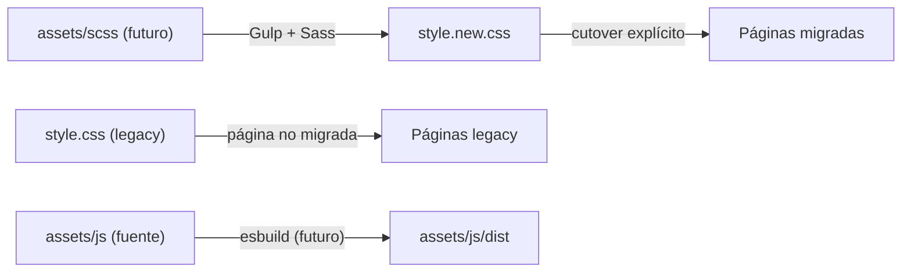

# Arquitectura — The Clandestino USA

Describe la arquitectura **vigente** y el **objetivo inmediato**. Lo marcado como *futuro* aún no existe en el repo.

## Vigente

- Páginas `.html` estáticas y PHP puntual (`contact.php`, `reservation.php`).
- CSS legacy en `assets/css/` (`style.css`, `style.min.css` y hojas específicas como `faq-styles.css`, `form-feedback.css`, `pure-soul.css`, `whatsapp-float.css`).
- JavaScript por página en `assets/js/` (scripts sueltos, sin bundler).
- Hosting: GoDaddy shared (cPanel). Despliegue de archivos estáticos y PHP simple.
- Inventario de UI actual: `docs/LEGACY-UI-INVENTORY.md`.

## Objetivo inmediato (futuro)

| Capa | Objetivo |
|---|---|
| Estilos | SCSS (7-1 pragmático) + Bootstrap 5 compilado desde Sass, BEM `cl-` |
| JavaScript | ES Modules + esbuild; output en `assets/js/dist/` |
| Build | Gulp para compilar SCSS y orquestar tareas |
| PHP | Simple primero; estructura solo cuando la complejidad lo pida |
| Datos | MySQL solo cuando una feature (checkout, Wine Club, reservas) lo requiera |

## Estrategia CSS: migración incremental

- `style.css` es **legacy** y sigue siendo el CSS de producción hasta su cutover.
- `style.new.css` será el **output** de la nueva arquitectura SCSS.
- La migración es **página por página**, con **cutover explícito**: cada página usa uno u otro sistema, y se cambia en un commit deliberado.
- **No cargar ambos sistemas indiscriminadamente** en la misma página: evita conflictos de especificidad y peso innecesario. Una excepción transitoria debe documentarse en la propia página/PR.
- Verificación de cada cutover: skill `qa-visual`.

## Reglas de arquitectura

- Refactor incremental del código existente; sin Laravel, React ni plantillas de terceros.
- Sin Redis, colas ni procesos persistentes (limitación del hosting).
- PHP: validación de input, escaping de output, CSRF en POST nuevos, importes recalculados en servidor.
- Los cambios de arquitectura se documentan aquí en el mismo commit que los introduce.
