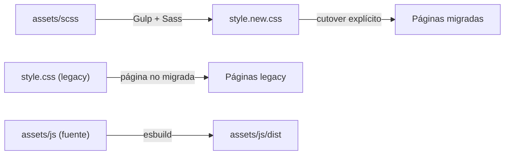

# Arquitectura — The Clandestino USA

Describe la arquitectura **vigente** y el **objetivo inmediato**. Lo marcado como *futuro* aún no existe en el repo.

## Vigente

- Páginas `.html` estáticas y PHP puntual (`contact.php`, `reservation.php`).
- CSS legacy en `assets/css/` (`style.css`, `style.min.css` y hojas específicas como `faq-styles.css`, `form-feedback.css`, `pure-soul.css`, `whatsapp-float.css`).
- JavaScript por página en `assets/js/` (scripts sueltos, sin bundler).
- Hosting: GoDaddy shared (cPanel). Despliegue de archivos estáticos y PHP simple.
- Inventario de UI actual: `docs/LEGACY-UI-INVENTORY.md`.

## Tooling frontend (vigente)

Pipeline en `gulpfile.mjs`. Compila la foundation SCSS y el JS nuevo. El legacy no se compila ni se modifica.

| Pieza | Detalle |
|---|---|
| Sass producto | `assets/scss/main.scss` → `assets/css/style.new.css` |
| Sass guía | `assets/scss/style-guide.scss` → `assets/css/style-guide.css`, solo en `npm run dev` |
| Bootstrap | 5.3.x desde `node_modules`, solo núcleo (root, reboot, containers, grid, helpers) |
| PostCSS | Autoprefixer siempre; cssnano solo en `build` |
| JS | Entrada `assets/js/main.js` → `assets/js/dist/main.js` (esbuild, ESM, `es2020`) |
| PHP local | `php -S 127.0.0.1:8000` lanzado por Gulp y cerrado al salir |
| BrowserSync | `http://localhost:3000` con proxy a PHP `:8000` (PHP real, no estáticos) |
| Lint | ESLint (JS nuevo y `.mjs` de tooling) y Stylelint (`assets/scss/**`) |

Comandos: `npm run dev` (clean → CSS de producto y de guía, con sourcemaps, más JS → PHP → BrowserSync → watch), `npm run build` (clean → `style.new.css` y JS minificados, sin sourcemaps, sin servidores y sin CSS de la guía), `npm run lint`.

Outputs (ignorados por git): `assets/css/style.new.css`, sus sourcemaps, `assets/css/style-guide.css` (+ `.map`, solo dev) y `assets/js/dist/**`. `clean` borra únicamente estos. `npm run build` no deja `style-guide.css`.

Separación legacy/new: los cambios en HTML/PHP/CSS/JS legacy solo recargan BrowserSync; no se compilan, optimizan ni regeneran (imágenes, sitemap).

## SCSS foundation (vigente)

Design system oscuro, todavía sin páginas de producto migradas. Entrada: `assets/scss/main.scss`.

```text
assets/scss/
├── main.scss                 # bundle de producto → style.new.css
├── style-guide.scss          # solo dev → style-guide.css
├── abstracts/_tokens.scss    # primitivos y overrides de Bootstrap
├── base/                     # custom properties, tipo, accesibilidad
└── components/               # cl-boton, cl-enlace, cl-campo, cl-tarjeta, cl-eyebrow, cl-divisor
```

`components/_guia.scss` (clases `cl-guia-*` y `cl-muestra-*`) solo presenta `style-guide/index.php`. Entra por `style-guide.scss`, no por `main.scss`, para que no infle el bundle de producto.

Los primitivos viven en SCSS y no se copian todos a `:root`. Las custom properties semánticas (`--color-fondo`, `--fuente-cuerpo`, `--espacio-1`…`--espacio-9`, etc.) salen de `base/_root.scss`. Los componentes leen esas variables.

Bootstrap 5.3 se personaliza entre `functions` y `variables`. `$enable-dark-mode: false`. Con eso, el build compila sin `variables-dark` y no genera `[data-bs-theme="dark"]`. El selector `[data-bs-theme="light"]` lo emite el propio `root` de Bootstrap junto a `:root` y no activa un tema claro.

Tipografía: Libre Bodoni en display y headings; Playfair Display solo en la cita editorial (`.cl-cita`); cuerpo, botones, labels y campos en la sans de sistema. No se descarga una fuente nueva. No se redefine `html { font-size }`.

Paleta de partida aprobada, con un ajuste medido: el borde fuerte pasa de 28% a 40% de cream (`rgb(243 239 230 / 40%)`) porque 28% quedaba ~2.3:1 y no identificaba un control. A 40% el mínimo medido es 3.33:1 sobre `neutral-700`. El borde al 12% sigue siendo decorativo. El vino no se usa como texto sobre el fondo (1.79:1). El resto de pares de texto usados superan 4.5:1; el detalle está en la guía, sección Colors.

### Style guide

`style-guide/index.php` enlaza `assets/css/style.new.css` y, después, `assets/css/style-guide.css`, más las familias que el sitio ya usa (Libre Bodoni y Playfair, eje recortado). No carga `style.css`, hojas legacy ni JS legacy. `style.new.css` es el bundle de producto; `style-guide.css` es output exclusivo de desarrollo y `npm run build` no lo genera.

En Apache/GoDaddy, `.htaccess` responde 403 a `^style-guide(/|$)` sin tocar los assets compartidos. El servidor embebido de PHP ignora `.htaccess`, así que `http://localhost:3000/style-guide/` sigue visible en local. `robots.txt` no es el mecanismo de bloqueo.

### Hojas legacy y cutover

`style.css` fija `html { font-size: 10px }`. La foundation usa la raíz del navegador. Cargar las dos hojas en la misma página hace que `rem` signifique dos cosas distintas. Multiplicar tamaños por 1.6 no es una migración válida.

Una página migrada depende del sistema nuevo. No carga a la vez, para compensar estilos que falten:

- `style.css`
- `style.min.css`
- hojas CSS específicas del legacy (`faq-styles.css`, `form-feedback.css`, `pure-soul.css`, `whatsapp-float.css` y las que se sumen)

Si una migración futura necesita una excepción temporal, el PR tiene que declararla, justificarla, nombrar el selector o la feature que la obliga y decir cuándo se elimina. No hay capa de compatibilidad ni se toca la raíz del legacy.

Cada cutover es un commit de una página, verificado con la skill `qa-visual` en 390, 768 y 1280. Ninguna página de producción enlaza `style.new.css` todavía.

## Objetivo inmediato (futuro)

| Capa | Objetivo |
|---|---|
| Estilos | Foundation vigente. Siguiente: layout (header, nav, footer) al migrar la primera página |
| JavaScript | Módulos en `assets/js/modules/**` importados desde `main.js` |
| PHP | Simple primero; estructura solo cuando la complejidad lo pida |
| Datos | MySQL solo cuando una feature (checkout, Wine Club, reservas) lo requiera |

## Estrategia CSS: migración incremental

- `style.css` es **legacy** y sigue siendo el CSS de producción hasta su cutover.
- `style.new.css` es el **output** de la foundation. Hoy solo lo carga `style-guide/index.php`.
- La migración es **página por página**: se quita el CSS legacy de esa página, se enlaza `style.new.css` y se reescribe el markup a `cl-` y al grid.
- Una página migrada no carga el CSS legacy y el nuevo a la vez para tapar huecos. La excepción temporal, si existiera, se documenta en el PR con selector, motivo y retirada.
- No hay hoja que compense la raíz de 10px del legacy.
- Verificación de cada cutover: skill `qa-visual`.



## Reglas de arquitectura

- Refactor incremental del código existente; sin Laravel, React ni plantillas de terceros.
- Sin Redis, colas ni procesos persistentes (limitación del hosting).
- PHP: validación de input, escaping de output, CSRF en POST nuevos, importes recalculados en servidor.
- Los cambios de arquitectura se documentan aquí en el mismo commit que los introduce.
